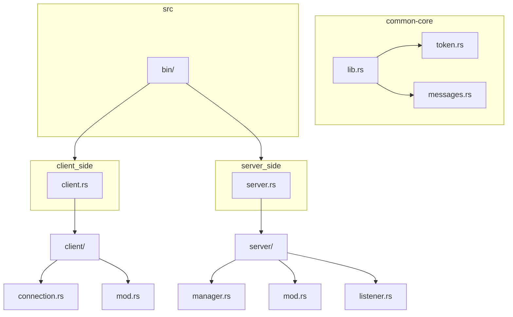

```mermaid
graph TD
    subgraph common-core
        lib[lib.rs]
        tokens[token.rs]
        messages[messages.rs]
        
    end

    subgraph src
        bin_dir[bin/]
    end

    bin_dir --> client_side
    bin_dir --> server_side

    subgraph client_side
        client_bin[client.rs]
    end

    subgraph server_side
        server_bin[server.rs]
    end

    client_bin --> client_mod[client/]
    server_bin --> server_mod[server/]

    client_mod --> conn_mod[connection.rs]
    client_mod --> mid_mod1[mod.rs]

    server_mod --> man_mod[manager.rs]
    server_mod --> mid_mod2[mod.rs]
    server_mod --> listeners[listener.rs]

    lib --> tokens
    lib --> messages
```
